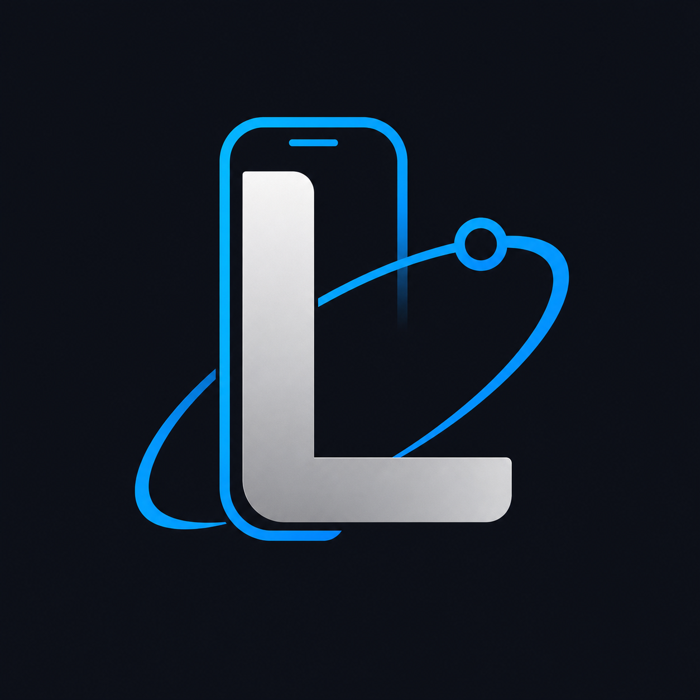

# LeoPhoneAgent

[](docs/LEOPHONEAGENT_1.0_BASELINE.md)
[](LICENSE)
[](#ios-10-baseline)

**A private, on-device AI agent for iPhone.**

LeoPhoneAgent is an independent GPLv3 fork of
[OpenMinis](https://github.com/OpenMinis/OpenMinis). It combines leading AI
models with an on-device Alpine Linux sandbox, browser automation, skills,
persistent memory and native iOS integrations. Version 1.0 establishes the
new brand and a reproducible iOS baseline for our own product work.

> LeoPhoneAgent is not the OpenMinis App Store product and is not affiliated
> with or endorsed by the OpenMinis maintainers. Upstream press quotes, store
> listings and release channels do not apply to this fork.



## What it can do

| Capability | iOS implementation |
|---|---|
| Bring your own model | Claude, OpenAI, Gemini and other providers through API keys or supported sign-in flows |
| Real Linux shell | ARM64 iSH runtime with an Alpine 3.21 root filesystem |
| Device tools | Calendar, Reminders, Contacts, Health, HomeKit, Bluetooth, Clipboard, media, alarms, location and more, subject to iOS permission and entitlement rules |
| Browser automation | Embedded browser workflows and web interaction tools |
| Skills and memory | On-demand skills, persistent sessions and workspace-scoped files |
| Native extensions | Share extension, File Provider, Widget and App Intents / Shortcuts |
| Media processing | Device ARM64 FFmpeg 6.1.2 and LAME |

Some integrations require user permission, an Apple entitlement, a provider
credential or a service-specific OAuth client. iOS does not permit unrestricted
background execution or arbitrary system control; LeoPhoneAgent works within
the platform sandbox and exposes supported operations through native bridges.

## iOS 1.0 baseline

- Product and scheme: `LeoPhoneAgent`
- Version/build: `1.0` (`1`)
- Main bundle ID: `com.leoyuan.leophoneagent`
- Deep-link schemes: `leophoneagent://` and `leophoneagent-mcp://`
- Apple development team: `54UB8X9C5F`
- Extensions: Share, File Provider and Agent Widget
- Device build: verified with signing disabled on Xcode 26.6

The remaining signed-build prerequisite is to sign into the matching Apple ID
in Xcode so automatic signing can create development profiles for the new app
and extension identifiers. See the exact command and capability inventory in
[the 1.0 baseline](docs/LEOPHONEAGENT_1.0_BASELINE.md).

## Build from source

Clone with submodules, then follow [BUILDING.md](BUILDING.md):

```sh
git clone --recurse-submodules https://github.com/leoyb1010/LeoPhoneAgent.git
cd LeoPhoneAgent

./deps/build_lame.sh
./deps/build_ffmpeg.sh
./deps/build_ish.sh
./deps/prepare_alpine_rootfs.sh

open src/ios/LeoPhoneAgent.xcodeproj
```

Select the `LeoPhoneAgent` scheme and an iPhone destination. Native artifacts
in this baseline target iOS device ARM64, not the simulator.

Android source is retained and has preliminary namespace/brand scaffolding,
but Android packaging and release validation are intentionally deferred while
the product focuses on iOS.

## Repository layout

```text
src/ios/          Swift / SwiftUI app and iOS extensions
src/android/      Kotlin / Compose app and JNI code (deferred)
src/shared/       Cross-platform assets
deps/             Native dependency scripts and vendored sources
docs/             Baseline, synchronization and architecture notes
scripts/          Rootfs and developer tooling
```

## Fork provenance and upstream updates

Version 1.0 is based on OpenMinis commit
[`9cf3a855`](https://github.com/OpenMinis/OpenMinis/commit/9cf3a855fecd27bb5735b84cacbd56852a3ab8dd).
We preserve upstream history and an `upstream` Git remote. The rebrand keeps
selected internal `minis-*` command names and sandbox paths for compatibility;
those are implementation details rather than customer-facing branding.

See [UPSTREAM_SYNC.md](docs/UPSTREAM_SYNC.md) before importing a new upstream
release so product changes remain isolated and reviewable.

## Open-source acknowledgements

This project builds on iSH and the OpenMinis ARM64 fork, Alpine Linux, FFmpeg,
LAME, SwiftAnthropic, SwiftMath, swift-cmark, RealTimeCutVADLibrary and Apple /
Swift Server packages. Android additionally uses PRoot, AndroidX, Jetpack
Compose and related libraries. Versions and license texts are documented in
[THIRD_PARTY_LICENSES.md](THIRD_PARTY_LICENSES.md).

## License

LeoPhoneAgent is distributed under the [GNU General Public License v3.0](LICENSE),
the same license as its upstream combined work. If you distribute a modified
binary, you must provide the corresponding source under GPLv3 and preserve all
applicable third-party notices. The LeoPhoneAgent name and generated artwork
identify this fork; do not use them to imply endorsement of another build.
