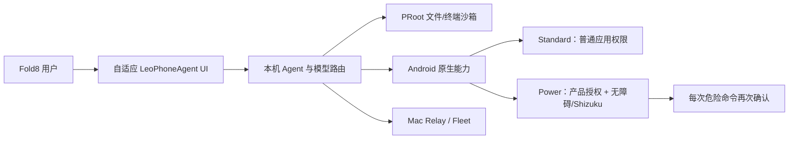

# LeoPhoneAgent Android 1.0.0-alpha.1 交付报告

日期：2026-08-16

目标设备：Samsung Galaxy Z Fold8 宽折叠形态（封面 10:16、展开约 4:3）

底座：OpenMinis/Minis Android 运行时，已改造为 LeoPhoneAgent 独立产品

## 结论

本轮 Android 施工范围已完成，可交付两个可独立安装、可同时运行的个人 Alpha APK：

- Standard：`com.leoyuan.leophoneagent`，默认私密、无跨应用高权限执行入口。
- Power：`com.leoyuan.leophoneagent.power`，在用户同时完成产品内授权与 Android 无障碍/Shizuku 系统授权后，提供更深的跨应用操控。

两版都具备独立本机 Agent、会话与文件沙箱、模型服务商、技能、语音、终端、计划任务、Android 系统能力和 Mac Relay/Fleet 协同。Standard 与 Power 使用独立包名和独立数据目录，不互相覆盖。

## 产品结构



## iOS 专属能力的 Android 替代

| iOS 能力 | Android 实现 |
|---|---|
| App Intents / Shortcuts | Intent、系统分享入口、计划任务与应用内自动化 |
| iCloud 文件 | Storage Access Framework、MediaStore、应用沙箱与 Relay 文件通道 |
| Keychain | Android Keystore 加密凭据存储；失败时仅内存保存并要求重新登录 |
| Background Tasks | WorkManager、AlarmManager、前台服务 |
| Siri / Speech | Android SpeechRecognizer、TTS 与可配置语音模型 |
| 跨应用操作 | Standard 使用公开 Intent；Power 使用无障碍与 Shizuku 双重授权 |
| Mac 协同 | HTTPS Relay/Fleet，任务、进度、审批和停止 |

按约定，Apple Watch、iCloud、App Intents 等 Apple 专属工程不计入本次 Android 施工；已采用上表中的 Android 原生替代路径。

## Fold8 与中文验收

- 封面态 1080×1728：单栏主页、输入区和快捷任务正常。
- 展开态 1768×2208：双栏布局正常，导航与正文各自保持清晰层级。
- 系统字体 200%：标题、顶部操作、`创建自动化` 和输入区不再裁切；内容可滚动。
- 简体中文：设置首页、服务商、模型组、存储、权限、技能导入、风险确认、主聊天操作和 TalkBack 标签均资源化。
- 构建门禁同时检查“默认字符串均有简体中文”与已知设置页英文硬编码，避免以后回退。
- API、OAuth、LLM、Token、Mac、Shizuku 等产品/技术专有名词保留原文。

## 五轮审计与 Debug

1. **多角色对抗审计**：产品/设计、安全、发布三角色检查；发现凭据明文降级、OAuth state、Debug RPC、Power 危险命令、中文/读屏、大字体和发布链问题。
2. **编译/单测/Lint**：Standard 与 Power 各 401 个 JVM 测试，0 失败（各 1 个既有跳过）；双 Release lint 为 0 error。
3. **Fold8 现场视觉与交互**：封面、展开、200% 字体、中文设置、中文 TalkBack、Power 状态文案均截图与 UI dump 验证。
4. **安全与发布对抗**：Debug RPC 无令牌 401、合法令牌 200；Standard 无 Shizuku 调试方法，Power 有方法但默认权限拒绝；合并 Manifest 验证备份/明文流量/Receiver 边界；APK 签名与内置法律文件验证。
5. **最终设备回归**：Fold8 API 35 模拟器执行 111 个 instrumented tests，0 跳过、0 失败；最终 Standard/Power Release 覆盖安装并同时存活。

## 安全与数据边界

- 凭据不再降级到明文 SharedPreferences；Keystore 损坏时 fail closed 到仅进程内存。
- OAuth 回调仅绑定 loopback，不记录 code/state，所有支持的 OAuth 流都必须校验 state。
- Debug RPC 仅 Debug 构建、仅 loopback，且同机/adb 客户端都必须提供每安装随机令牌。
- Release 禁止普通明文 HTTP；仅网络安全配置保留本机 loopback 调试边界。
- 应用备份关闭，并用备份规则再次排除应用数据。
- Power 的任意 shell/破坏性命令必须逐次展示完整命令并确认，不能被“本会话允许”绕过。
- 无障碍事件只在有主动监听者时采集，并忽略密码字段。
- 分享入口限制 20 项、单文件 100 MB、单次 200 MB。

## 构建与供应链

- Android Gradle Plugin 8.13.2、Gradle 8.13、JDK 17、NDK 27.0.12077973。
- Alpine 3.21.3 rootfs 与 PRoot 二进制均固定 SHA-256，下载或缓存不匹配时立即失败。
- 新增 Android CI：双版本测试、中文门禁、lint、Release assemble。
- APK 内含 GPL-3.0、第三方许可、隐私说明和源码提供说明。
- R8 mapping/seeds 与 APK 一同归档，便于还原崩溃栈。

## 交付边界与评分

- **个人 Alpha 可用度：92/100**。当前 APK 可安装、可并存、主路径和安全门禁可用。
- **公开商店生产度：80/100**。剩余项主要是发行方正式 keystore/证书托管、真实 Fold8 物理机长稳与功耗测试、数据库全版本覆盖升级 fixture、商店隐私表单与正式发布签名链。
- 当前 APK 使用显式参数 `-Pleophone.allowDebugReleaseSigning=true` 生成个人 Alpha 调试证书；默认 Release 构建不会静默采用调试证书。正式发布必须由发行方提供 keystore，不能把本次个人 Alpha 证书作为商店升级链。

## 复现命令

```bash
cd src/android
export JAVA_HOME='/opt/homebrew/opt/openjdk@17/libexec/openjdk.jdk/Contents/Home'
./gradlew \
  :app:verifyChineseResources \
  :app:verifyChineseSettingsStrings \
  :app:testStandardDebugUnitTest \
  :app:testPowerDebugUnitTest \
  :app:lintStandardRelease \
  :app:lintPowerRelease \
  :app:assembleStandardRelease \
  :app:assemblePowerRelease \
  -Pleophone.allowDebugReleaseSigning=true
```
