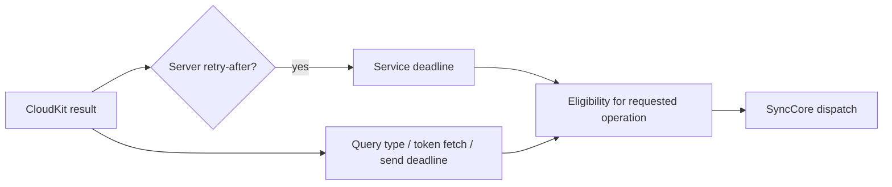

# iCloud retry isolation

Status: implementing A1/A2 of the approved 2026-09-28 connectivity plan.

The 2026-09-28 device trace showed a missing record type query setting a
transport-wide deadline. Successful uploads were then deferred for 114 seconds.

## Rules and owner

- CloudKit transport owns service-issued throttling and query eligibility.
- A query error delays only that record type. A token-fetch error delays only
  the explicit token-fetch attempt. Neither creates an upload deadline.
- Only a server-provided retry-after hint may delay all CloudKit operations.
  Successful operations cannot clear an unexpired server deadline.
- Whole-send failures use their own bounded exponential backoff. Per-record
  hints must be consumed; a local rejection is not evidence of global throttling.
- Dirty changes survive failures. Acknowledgements and multi-destination
  delivery are addressed in the subsequent delivery-ledger slice.
- Skipped queries are not successful: they cannot advance configuration
  anchors. A failing type's query cursor must not advance due to another type.
- Retry deadlines survive process restarts. Success resets only its own scope.
- Queries on missing optional/legacy types remain visible and are retried with
  a bound, without blocking unrelated data. Error 11 in a record-save operation
  retains the existing stale-etag recovery semantics.

## Acceptance

1. A missing SkillV2 query leaves MessageV2 queries and uploads eligible.
2. An explicit 429 retry-after gates query and upload, including manual/foreground
   dispatch; unrelated success does not shorten it.
3. A successful type resets only its failure streak. Repeated local failures
   remain bounded, with jitter only adding delay, never reducing a server hint.
4. Serialized retry state preserves deadlines. Expired deadlines allow work.
5. Runtime logs distinguish local retry backoff from service throttling.

Validation: focused Swift retry-policy smoke test, iOS build, then real-device
startup and partial-failure/recovery checks. Do not reset user CloudKit zones.
