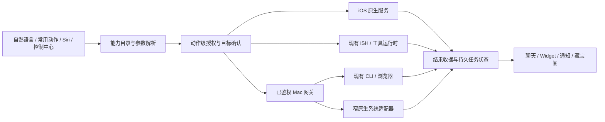

# LeoPhoneAgent iOS 与 Mac 下一版本升级方案

建议将下一版定义为：**手机上的系统动作真正即用，Mac 上的任务持续可接管，所有成功状态都有依据，界面和动效围绕任务连续性展开。** 建议版本占位为 iOS **1.35.0 (110)**、Mac **1.85.0**；实施前重新核对远端版本，保持递增。

本次已完成最新代码同步确认、五轮分层审计、相关测试、Mac 组件实际渲染与键盘检查，以及上游和 Apple 系统能力研究。没有实施产品升级、修改产品源码、发布或装机。方案的核心不是增加工具数量：已有26类 iOS 原生能力、藏宝阁、控制中心、端侧模型和跨设备协议应继续利用；本次发现的授权、结果判定、回放和窗口执行缺口必须先闭合。

## 一、结论与推荐范围

下一版本应交付六个用户能直接感知的结果：

1. **“打开手电筒”立即执行。** 常用系统动作不需要先启动 iSH 或等待云模型；手电筒、计时器、扫码、快速笔记均可从自然语言、常用动作和系统入口到达。硬件不支持、权限拒绝和系统占用给出准确反馈。
2. **同一任务在手机与 Mac 之间不断线、不串结果。** 开始、排队、执行、待审批、暂停、取消、失败、成功使用同一结果契约；重连游标带运行身份，排队任务不绑定旧连接。
3. **Mac 接管有真实窗口证据。** 当前窗口 API 的内存模拟路径先准确降级，再接公开原生观察和动作适配器；没有发生动作就不能返回成功。
4. **首页、设置、聊天和藏宝阁更快、更清楚。** 一次提交、稳定滚动、可发现的系统动作、准确的空态、不中断阅读的资料处理，以及能被键盘和读屏使用的弹层。
5. **离线就是离线，取消确实停止。** 修正系统 ASR 静默转在线，补相机、录音、外设、后台任务和外部 Shortcut 的生命周期与回执。
6. **能力增强同时控制体积和维护成本。** 按子系统吸收上游备份恢复、会话分支、事件契约和能耗策略；基础动效沿用现有 token，语音引擎先比较再二选一，不重写整个产品。

目标是按本报告评分表达到 **90/100**。这是升级后的验收目标，不是已经发生的成绩；当前流畅度缺真机测量，不能拿动画数量、代码行数或测试总数代替体验评分。

### 交付文件

- [五轮审计与升级主方案](./NEXT_VERSION_PLAN.md)
- [80项系统能力矩阵](./capability-matrix.md) · [CSV](./capability-matrix.csv)
- [iOS逐调用链审计](./ios-audit.md)
- [Mac逐调用链审计](./mac-audit.md)
- [UI交互审计与5张本次截图](./ui-audit.md)
- [16个上游/开源参考项目与取舍](./upstream-research.md) · [来源及固定源码链接](./sources.json)
- [完整来源索引](./SOURCE_INDEX.md)
- [实施工作包](./implementation-backlog.csv) · [验收场景](./acceptance-matrix.csv)

## 二、基线与前序要求对账

| 项目 | 本次确认 |
|---|---|
| 主机 | LeoyuandeMacBook-Pro-2.local |
| 唯一产品仓 | `/Users/leoyuan/Documents/日常 2/LeoPhoneAgent` |
| 任务与报告目录 | `/Users/leoyuan/Documents/ChatGPT/LeophoneAgent`；这里原先只有历史截图，不是产品源码仓 |
| 最新 origin/main / HEAD | `094d4f8c97656366ec3a7858f9b0bd1b368ab7d2` |
| 拉取 | `git fetch origin`、`git pull --ff-only --no-recurse-submodules origin main`，结果 Already up to date |
| 产品源码版本 | iOS 1.34.0 (109)，Mac 1.84.0 |
| 本机已安装 Mac | 1.74.2；没有拿旧安装包验证1.84.0 |
| 开发环境 | Xcode26.6；逻辑测试使用iPhone17Pro/iOS26.5模拟器 |
| 本地改动 | tracked源码未改；原有未知 `docs/AUDIT_THREE_ROUNDS_2026-09-06 2.md` 保留 |
| 范围 | iOS/iPadOS与Mac；Android、Harmony、watchOS新功能不纳入施工范围 |

继承的需求来自关联任务“合并双仓并升级产品体验”和仓库中的既有升级计划。本次不继承旧任务的自动装机、发布执行时机：当前请求明确以调研、审计和下一步方案为交付。

| 前序要求 | 当前事实 | 下一版差额 |
|---|---|---|
| 一个主仓维护 | Mac已并入 `src/mac/leocodebox`；Python为兼容回退 | 保持；不再重复并仓，不留下第二主仓 |
| 首页“开始”一次提交 | iOS `runHomePrompt→sendPrompt`已经存在；Mac新任务已修 | 保护草稿、重复点击、换目标与失败恢复；加入无需模型的本机动作 |
| 昨天/本周/本月折叠 | iOS已默认折叠并持久化；Mac已有更早组 | 保留并测长列表与搜索，不再次计为新功能 |
| 系统能力全面可发现 | 26类原生handler已有，但目录和执行边界未统一 | 80项需求级矩阵、逐动作可用性、授权和结果回读 |
| 设置层级与动效 | iOS四组+搜索+层级区分已有；Mac侧栏已成形 | 修分类归属、搜索词与本地化、键盘模态、运行时减少动态效果 |
| 藏宝阁从demo到工作区 | SQLite/原件/高亮/增量/按需下载已做 | 全局入口、全库分页、Mac OCR/转写、阅读优先和真实增强状态 |
| 全局动效、避免卡顿闪退 | LeoMotion、CSS token、列表缓存、虚拟列表基础已有 | 修400行边界与重挂动画、减少无效刷新，真机指标验收 |
| Ponytail避免臃肿 | 核心文件仍很大，协议/结果判断分散 | 按不变量收敛；删除经过引用和测试证明的重复代码 |
| Mac热更新及旧版本升级 | 更新链已存在；旧1.4附近版本历史兼容需单独覆盖 | 下一版最终签名包验证旧稳定包→新版，保留数据/凭据/升级回退证据 |
| iPhone HTML/图片等输出 | artifact、WebApp、文件预览与分享基础已有 | 区分生成、预览、导出、保存和跨端交接五步成功状态 |

## 三、五轮审计的实际内容

五轮是针对同一不可变基线、用不同问题进行的分层审计。没有声称做了五次独立的完整安全扫描，也没有为同一未变化产物递归打分。

| 轮次 | 审计问题 | 主要证据与结果 | 仍有限制 |
|---|---|---|---|
| 1 基线与架构 | 最新代码在哪里，历史承诺哪些已实现，真正上游是谁 | 单一主仓/版本/提交核对；保留既有首页、分组、Widget、Spotlight、Foundation Models成果；确认CloudCLI真实上游 | 历史报告是线索，不能代替当日实测 |
| 2 系统能力与权限 | 每个动作是否真的可调用，授权在哪一层，缺什么 | 26类handler调用链；80项系统能力矩阵；手电筒缺失、native权限只预检首命令、扫码首次授权顺序、Shortcut只有launched | 硬件/家庭/健康/外设逐动作真机未执行 |
| 3 正确性与恢复 | 失败是否假成功，重连是否漏事件，取消是否收尾 | 快捷任务结果误判、ASR离线策略、后台grant误判、Mac运行游标/旧连接队列/单订阅者、窗口模拟成功、日志持久失败 | 多设备故障注入和真实provider副作用未执行 |
| 4 UI、动效、性能与可维护性 | 动线是否可发现，是否丝滑，膨胀在哪里 | Mac5张新截图；抽屉焦点穿透实测、Storage搜索错位、外观分类混杂；400行日志重挂；同步IO；Ponytail清单 | iOS新完整App因模拟器库链接失败未渲染；FPS/耗电未测 |
| 5 验证、上游和发布反证 | 测试通过能证明什么，哪些旧结论已失效，哪些参考真正适合 | iOS337逻辑测试；Mac桌面37/客户端162/relay13；类型与前端构建通过；服务端补验证；最新依赖通告；16项目/44固定源码引用 | 无签名新App/公证/装机证明；依赖关联不等于已验证漏洞 |

第5轮主动排除和修正了几类错误结论：相机等待已有100ms可取消轮询，问题在取消后的UI收尾；iOS控制中心和Spotlight已经接入，不应再作为空白；Mac REST补拉可恢复已持久内容，所以重连问题不能夸大为整段对话必丢；iSH的Asbestos后端不是突破iOS限制的运行时JIT。

## 四、必须先处理的工程问题

此处 **P0指下一版本放行前的工作优先级**，不是把所有问题判成灾难或已可利用漏洞。详细触发条件、代码行号和局部复现分别在两端审计附件中。

| 工作优先级 / 发现 | 后果与证据 | 最小修复方向 | 验收关键点 |
|---|---|---|---|
| P0 · IOS-01 原生授权预检只识别首个apple命令 | 复合命令/脚本可绕过产品内禁用；OS TCC仍有效 | 授权放到真实native dispatch，携带任务上下文，按能力+动作检查 | 模拟handler覆盖所有入口；禁止通讯录时组合命令/脚本仍被拦 |
| P0 · IOS-02 快捷任务把停止/非空文字当成功 | 失败、取消、中间解释可能显示Done | 复用持久run终态，通知/Shortcut/Widget读同一结果 | 先文字后失败、无文字产物成功、超时仍运行均准确 |
| P0 · IOS-08 Offline可静默转在线 | 用户明确的离线选择未在请求层守住 | Strict Offline / Auto / Online三种政策；严格离线不支持则明确不可用 | 离线分支永不构造允许服务端请求；网络观测佐证 |
| P0 · M05 窗口操作只有内存更新 | observe刷新旧快照时间；act可报success但未执行系统动作 | 先返回unsupported；再接真实观察、目标校验、动作和回读 | 切窗、重建、遮挡、权限撤销；无动作绝不显示完成 |
| P0 · M01 跨轮重连游标失配 | 每run从0计数，客户端保留旧高水位 | 游标带runID/epoch，服务端返回当前运行身份 | 第1轮1000帧、第2轮50帧断线，多设备发起也不漏 |
| P0 · M02/M03 队列与订阅绑定连接 | 排队闭包持有旧ws；新观察者替换旧writer | 队列存数据；执行时读取当前订阅集合；原子消费审批 | 排队后重连、双端旁观、双端同批、进程重启 |
| P0 · M12 日志写失败仍广播 | 显示/推送的事件未必可恢复 | 顺序writer、durableSeq、关键事件提交和可见降级 | ENOSPC/EACCES/半行/慢订阅者，不静默假装已持久 |
| P0 · IOS-03 后台有效性取自设置开关 | 音频引擎失败时仍跳过暂停/检查点 | configured与实际系统grant分开，到期先checkpoint | 来电/启动失败/过期/锁屏，不声称无限保活 |
| P0 · M14 当前依赖通告重新出现 | 官方npm生产audit返回8受影响包节点 | Multer/Hono/js-yaml分批验证升级或给不可达证据 | 更新锁文件与override；上传中断/YAML/更新源回归 |
| P1 · IOS-04/07 相机取消收尾与首次扫码 | 取消后仍占busy；首次扫码可能在申请权限前失败 | operationID、幂等cancel、统一清理；先授权再检查可用 | 连续开关/取消/迟到回调/首次拒绝与再次允许 |
| P1 · IOS-05 Shortcut无完成回执 | URL成功打开只能证明launched | 一次性关联标记、awaitingExternal、独立完成/取消/失败回调 | 结果错配/迟到/重复/无回调均明确 |
| P1 · M06 同步窗口枚举 | osascript最长4秒同步占住Node | 异步窄helper、取消/超时、合并并发观察 | 人工注入4秒延迟，审批和health仍可响应 |
| P1 · M08 日志400行边界 | 不再自动跟随；seq-index导致保留行重挂入场 | 稳定eventID、视口虚拟化、末事件跟随、旧消息无动画 | 第400→401行、手动上滚、文本选择、1000行回放 |
| P1 · M04/10 状态过期和残留红错 | 网络失败仍算在线；重连后错误可能不清 | lastSuccessAt/stale和transient error生命周期 | 单一真实状态、恢复清错、陈旧列表仍可读 |
| P1 · M09 模态焦点穿透 | 本次CUA已复现Tab进入遮罩后控件 | 共用Dialog行为，inert/focus trap/restore | 键盘、Esc、嵌套弹层、VoiceOver |
| P1 · UI-04 藏宝阁全局入口与中文标签 | ⌘K“藏宝阁”只出现Storage设置 | 工作区动作登记+labelKey本地化 | 无项目也能打开/搜索/收集，不落到存储清理 |
| P1 · UI-05 藏宝阁只取前200条再筛合集 | 旧合集可能消失，“全部”无连续浏览 | SQL内筛选排序+cursor，独立facets | 1万条/第201条/旧合集/中文正文命中 |
| P1 · M11 通知设置IPC来源弱于其他接口 | 非目标loopback页面可能修改通知偏好 | 所有写IPC统一校验实际sender/frame/origin | 正确origin允许，其他端口/iframe/导航后拒绝 |
| P2 · M13 TS/Python能力漂移 | 备用服务能力不等价，客户端容易误判 | JSON契约与能力协商；明确降级而非强制重写 | Swift/TS/Python同fixture；未知字段与旧客户端兼容 |

### 依赖通告的准确解释

官方npm JSON报告的8个节点包括传递影响，并非8个已验证可利用漏洞。直接相关的Multer当前为2.2.0，项目有multipart上传入口；公开通告已给出2.3.0修复线。js-yaml的修复线为3.15.2/4.3.2。Hono的实际使用sink需单独核验，不能因为依赖中出现就报告本项目存在toSSG漏洞。该结果解释了为什么9月6日“0漏洞”不能继续沿用。[Multer字段名通告](https://github.com/advisories/GHSA-wc9g-mqfw-jrwm)、[中断上传通告](https://github.com/advisories/GHSA-qfvm-cv95-jqjf)、[js-yaml通告](https://github.com/advisories/GHSA-2883-xcg3-v3hh)、[Hono通告](https://github.com/advisories/GHSA-g6gw-c38x-mqfc)。

## 五、系统能力如何真正全面开放

### 5.1 完整建账，明确四类执行方式

“全面”应体现在所有相关能力都可查到支持范围、当前条件和替代路径，而不是声称普通App拥有所有系统权限。Apple规定第三方App只能经系统明确提供的服务访问沙箱外信息；iSH、MCP、Siri或录屏都不会自动扩大这一边界。[Apple运行时安全](https://support.apple.com/guide/security/security-of-runtime-process-sec15bfe098e/web)。

| 类别 | 例子 | 用户体验 |
|---|---|---|
| 公开原生接口可完成 | 手电筒、设备状态、EventKit、Photos、HealthKit、HomeKit | 条件满足后执行，回读状态或结果ID |
| 需要系统/前台交互 | 选照片/目录、拍摄、扫码、短信/邮件、分享、音频路由 | 清楚说明接下来出现的界面，保留任务，区分呈现与完成 |
| 需要用户配置或专项资格 | Shortcuts、第三方App、FamilyControls、NetworkExtension、外设配对 | 检查实际授权和集成，结果不可得时显示已交接/待确认 |
| 普通App没有通用权限 | 任意其他App私有数据、任意注入点击、系统总开关、支付密钥 | 明确不支持，并给公开集成或用户操作路径 |

完整80项矩阵覆盖设备即时动作、拍摄/语音/视觉、日历/健康/家庭、文件/格式、近场硬件、系统入口、后台生命周期和受限边界。它是需求级能力家族清单，不是Apple所有符号的机械穷举。后续新增API应通过同一目录持续扩展。

### 5.2 手电筒必须成为一个完成的纵向功能

建议在现有NativeOffloads旁增加窄服务，由现有CLI、快捷入口和Agent共用。工具名可以继续兼容现有apple命令体系，内部统一为 `device.torch.set` / `device.torch.status`；命名是接口决策，不能为此造第二个通用工具框架。

完整链路：**识别明确指令 → 确认执行设备 → 检查产品授权与硬件 → 串行配置 → 系统状态回读 → UI/语音/任务收据**。明确的“打开/关闭”走确定性路径；“把那个亮一点”涉及目标歧义时才追问。重复请求使用set而不是toggle，防止重试把刚打开的灯反向关闭。

必须处理：`hasTorch`、`isTorchAvailable`、当前支持亮度、`lockForConfiguration/unlockForConfiguration`、摄像头占用、热限制、来电/后台中断、设备无灯和系统主动关闭。状态不可用就返回原因；不能用“调用没抛错”替代实际回读。[Apple hasTorch](https://developer.apple.com/documentation/avfoundation/avcapturedevice/hastorch)、[设置亮度](https://developer.apple.com/documentation/avfoundation/avcapturedevice/settorchmodeon(level:))。

交付面包括：自然语言、常用动作、能力中心状态、Siri/Control/Action Button复用入口、操作收据、无硬件降级、并发与取消测试。Mac发出指令时必须明确目标是哪个iPhone；手机离线时不排队等待数小时后突然点灯。此类瞬时设备操作默认短TTL，过期取消。

### 5.3 先深化已有26类能力

- **日历/提醒/闹钟**：自然语言参数正规化，重复/时区/清单歧义，创建前摘要，写入后ID回读。AlarmKit管理本App的闹钟与计时器，不能宣传为任意编辑Clock App全部闹钟。[AlarmKit](https://developer.apple.com/documentation/alarmkit)。
- **拍摄/扫描/OCR**：修首次授权与取消，结果直接进入可检索artifact/藏宝阁，不把用户再送入多层临时页。Mac图片目前明确标记OCR不可用，可用Vision补齐，复用已有增强队列。
- **语音**：先守住离线政策，再评估SpeechAnalyzer。它在iOS26提供新的端上转写接口，语言和设备可用性仍需检查；WhisperKit/whisper.cpp只作为经过基准选择的一种补充。[Apple SpeechAnalyzer介绍](https://developer.apple.com/videos/play/wwdc2025/277/)。
- **照片/通讯录/健康/家庭**：目录从“有权限”细化到可读数据范围、可写动作、需确认和不可观察状态。HealthKit空数据不能被误判为已拒绝；危险家庭设备操作不沿用只读授权。
- **蓝牙/NFC/近场**：已有底层能力很广，重点是设备会话、订阅收尾、重连和授权范围。AccessorySetupKit/Wi-Fi Aware/UWB/RoomPlan只在真实需求与硬件存在时专项接入，不成为默认体积和启动负担。
- **亮度/音量/输出路由/触觉**：补小能力的真实体验。iOS屏幕亮度有公开接口及锁屏后恢复规则；媒体音量优先提供官方用户控件。不要依赖内部子视图恰好存在就声称系统音量设置成功。[UIScreen亮度](https://developer.apple.com/documentation/uikit/uiscreen/brightness)、[MPVolumeView](https://developer.apple.com/documentation/mediaplayer/mpvolumeview)。

### 5.4 系统入口不是再实现一份能力

现有新对话、语音、相机ControlWidget、Siri、会话/收藏Spotlight、Widget、Live Activity均保留。下一版从同一descriptor生成可展示动作与参数，只新增真正有价值的入口：手电筒、快速收集、扫码、常用任务、待审批任务直达。已存在的入口不重复新增Target。

短信/邮件必须区分“草稿已准备”“用户已提交”“实际送达”。Apple的邮件撰写回调并不保证邮件送达，不能把它包装成Agent已经完成投递。[MFMailComposeViewController](https://developer.apple.com/documentation/messageui/mfmailcomposeviewcontroller)。

### 5.5 iOS26稳定线与27能力研究线分开

本机SDK为26.6。Apple当日文档已将ScreenCaptureKit的iOS/iPadOS支持和LongRunningIntent标为27.0引入；不能把新网页上的API直接写进当前可构建主线。建议另列SDK影子构建与运行时能力协商，验证后再开放；不把它们作为这次26线版本的默认依赖。[ScreenCaptureKit](https://developer.apple.com/documentation/screencapturekit)、[LongRunningIntent](https://developer.apple.com/documentation/appintents/longrunningintent)。

当前26线继续用已经接入的BGContinuedProcessing、检查点与用户恢复。它由前台用户动作开始，系统可撤销，必须报告真实进度；不能以静音音频/定位或连续申请有限后台时间保证通用Agent永不停止。[Apple持续后台处理](https://developer.apple.com/documentation/backgroundtasks/performing-long-running-tasks-on-ios-and-ipados)。

## 六、最小可维护架构

### 6.1 统一语义，不重写现有运行时

保留SwiftUI/现有iSH原生桥、React/Electron、LeoHarness和SQLite。增加的共享内容优先是 **能力描述、执行请求、审批、结果收据、事件游标的schema与golden fixtures**。Swift/TypeScript/Python各自使用适合平台的实现，避免用跨语言巨型SDK把简单契约复杂化。

### 6.2 能力描述的必要字段

每个动作定义：稳定ID、中文名称/同义词、参数schema、输出schema、平台/最低版本、硬件条件、系统权限、产品授权、前台条件、作用域、风险、可撤销性、幂等方式、可验证结果、离线与网络依赖。运行时状态独立记录，不把“配置过”当成“现在可用”。

目录、能力中心、工具schema和入口可共用这份定义；不让模型、UI与native handler各自维护一份名单。仅有一个实现的服务使用普通类型/函数，不加无必要工厂与依赖注入层。

### 6.3 请求、授权与结果

请求最小包含 `requestID、operationID、sessionID、runID、targetDevice、capabilityID、parameters、scope、deadline`。由实际用户授权形成grant，绑定动作/目标/范围/有效期；外部网页、PDF、OCR、MCP说明和工具结果不能自行生成授权。

结果至少区分：`prepared、awaitingUser、running、succeeded、failed、cancelled、suspended、handedOff、unknownOutcome`。收据包含实际执行设备、开始/结束时间、结果引用、验证方式、可撤销范围。不要把“没有assistant文字”判失败，也不要把“有文字”判成功。

**unknownOutcome是必要状态。** 副作用可能已发生但回执丢失时，先按系统ID/operationID查询；查不到也不能盲目重试发送邮件、创建重复提醒或反向toggle。只对幂等动作自动重试。

### 6.4 回放与订阅

现有seq升级为 `{runID, epoch, seq}`，区分 `observedSeq` 与 `durableSeq`。按运行维护多观察者，审批控制权独立；同一approvalID只能原子解决一次。队列存数据与附件引用，不保存WebSocket闭包。

持久日志使用顺序异步writer；先保留NDJSON并加稀疏seq→byte索引和有界读取，只有确需事务投影才使用项目已有SQLite。审批/终态要有提交依据；临时流可继续展示，但必须明确持久化降级。回放结束与实时接续有明确边界，避免中间空窗。

### 6.5 Mac原生helper的边界

先支持少量公开能力：窗口枚举/绑定/真实观察、ScreenCaptureKit用户选定范围、AX元素/菜单动作、文件与Quick Look、剪贴板/通知、必要的EventKit/Contacts。helper不接受任意可执行代码字符串，IPC验证调用者、动作、参数和目标。

窗口身份不能仅凭标题或“恰好前台”。使用进程身份、窗口标识、几何、代次和捕获时间；动作前重新检查，动作后取得回读依据。权限撤销、窗口重建和遮挡时停止并给用户恢复路径。复用macOS公开API，不能移植参考项目里的私有ScreenCaptureKit路径。[AXUIElement](https://developer.apple.com/documentation/applicationservices/axuielement)、[系统内容选择器](https://developer.apple.com/documentation/screencapturekit/sccontentsharingpicker)。

## 七、UI、动效和动画升级设计

### 7.1 iPhone首页：任务入口与设备动作清晰分工

保留一个主输入和一次“开始”。执行目标使用“此iPhone / 指定Mac”，模型/权限放在可展开的任务配置中。输入下方展示少量常用动作，建议默认语音、扫码、手电筒、快速收集，再由用户固定最多六项；“全部能力”打开可搜索目录。真正的设备动作不必创建一段空聊天。

今日任务按“需要处理→正在进行→最近完成”排列；历史分组保持现有默认折叠。状态行包含结果或下一动作，而不是只显示动画灯点。远程目标不可达时保留输入和附件，反馈“未发送”，不给虚假的已接单状态。对长按、反复点击、切目标、键盘出现和后台返回分别回归。

### 7.2 Mac工作台：把注意力留给当前任务

保留项目/会话/产物与终端的工作结构，减少首页解释文字，默认参数集中到输入附近。⌘N创建干净任务态，⌘K搜索项目、任务、文件、藏宝阁和能力动作；显示中文标签与明确作用目标。

远程机器摘要加入更新时间和stale，不再把旧快照算在线。聊天底部显示“有新消息”而非强拉用户阅读位置；审批卡写清目标、将发生的改动和一次/拒绝选项。完成时就地出现结果卡或可打开产物，避免空泛的成功庆祝。复用已有虚拟列表，不引入第二套聊天渲染器。

### 7.3 设置：语义一致，平台布局各自原生

iOS保留四组+搜索；Mac保留适合宽屏的侧栏。统一名词与条目归属：设备/连接、Agent运行默认值、外观与通用、数据与关于。Mac“外观”中的默认Agent/模型/权限移回Agent；搜索使用本地化标签、动作同义词和目标页，而非直接展示英文配置ID。

能力详情显示“这台设备支持什么、尚缺哪个权限、可否后台、最近执行结果”，一键自测只运行该项经过用户触发的低风险探针。不能为了让状态看起来全绿主动索取所有隐私权限。

### 7.4 藏宝阁：收集轻，阅读强，状态可信

将已有工作区分成三个连续阶段：**先收下原件 → 后台增强与索引 → 阅读/引用/交给Agent**。保存成功先给回执，OCR失败仍保留原件；处理、部分完成、失败、待手机、可离线都有清楚的状态。

Mac首页与⌘K有真正的藏宝阁入口；iPad宽屏使用已有双栏，窄窗口保持单栏。列表由全库筛选后分页，合集数量独立取数。阅读页把正文、来源、笔记、高亮和继续任务放在主位，同步技术配置收进菜单。补Mac图片OCR、扫描PDF与音频转写；不因为现有服务返回partial而假装处理已完成。

### 7.5 HTML、图片和其他产物

统一artifact元数据：类型、MIME、字节数、摘要、来源任务、生成阶段、预览能力、同步状态。HTML预览保留隔离与外联策略，不能获得模型凭据或系统工具权限；图片/PDF实际可打开，损坏内容明确报错。

典型链路：“做一份HTML报告→本机预览→保存藏宝阁→Mac接续编辑→导出图片/PDF/原文件”。每步分别记录成功；需要Mac能力时准确交接，手机离线也能查看已保存结果。新版本验收覆盖中文文件名、超大图、离线资源、分享扩展内存和导出取消。

### 7.6 动效必须跟随真实状态

沿用已有青绿主色、系统字体、动态颜色、`LeoMotion/LeoHaptics`与Mac CSS token。Leotexiao只选择适合控件的模式：按压、折叠、状态标签、复制确认、阶段进度。示例里的固定100px高度、假计时完成和无取消的指针事件不能直接进入产品。

| 场景 | 建议目标 | 流畅性/无障碍约束 |
|---|---|---|
| 频繁按钮 | 80–120ms可见反馈，小幅0.97–0.99按压 | 执行不等动画；键盘同样反馈；可立即中断 |
| 选择/状态切换 | 180–240ms | 状态与文案先准确；旧事件回放不重播 |
| 面板/设置折叠 | 220–280ms，复用现有panel token | 高度依据真实内容；焦点/输入不丢；反向操作接续 |
| 审批/完成 | 一次短过渡，约240–350ms | 不循环闪烁；完成依据receipt；高风险信息优先 |
| 语音 | 真实电平、低频轻量波形 | 录音停止/离屏/来电立即收尾；不装饰性保活 |
| 流式消息 | 稳定行身份、批量更新、滚动锚点 | 不给每token和回放行开入场动画；上滚不抢位置 |
| 大列表/缩略图 | 只动画新插入的有限对象 | 后台/离屏/低电/热态停止非必要循环 |

这些时长是待真机调优的产品目标。减少动态效果开启时保留状态、焦点和必要淡变，移除位移、缩放、持续旋转；同时覆盖提高对比度、减少透明度、Dynamic Type和VoiceOver。性能分析使用SwiftUI Instruments的视图更新与因果图，先定位无效更新再优化。[Apple SwiftUI性能](https://developer.apple.com/documentation/xcode/understanding-and-improving-swiftui-performance)、[Reduce Motion](https://developer.apple.com/documentation/swiftui/environmentvalues/accessibilityreducemotion)。

## 八、上游与开源项目的吸收计划

| 来源 | 已核实差额 / 借鉴点 | 本版取舍 |
|---|---|---|
| OpenMinis 1.13 | 图差417/26；本地缺BackupZipWriter与RestoreJournal | 吸收流式备份和恢复journal；不整树覆盖自有功能 |
| OpenMinis/ish-arm64 | 本地对master为1/43；独有可取消native offload补丁 | 以审核固定点升级；保留取消补丁；信号/内存回归与模拟器策略同验 |
| CloudCLI UI v1.37.3 | Mac真实上游；thread/fork与lastTurnId | 按能力启用会话分支；长会话补丁单独评估，保留本地鉴权 |
| openai/codex | 官方app-server线程/轮次/审批schema | 在现有Provider中适配，固定已安装CLI可用契约 |
| Agent Client Protocol | permission、resume、取消、能力握手 | 借稳定v1契约做映射；不再建一套业务状态机 |
| OpenCode | 持久事件、序号/投影不变量 | 借事务和回放思想，不引入完整Effect运行时 |
| CodexBar | 交互/活动/低电/热态自适应刷新 | 一个刷新策略表，减少空闲轮询 |
| CC Switch | 熔断/half-open恢复 | 仅改现有Provider故障转移，禁止盲重试副作用 |
| Peekaboo | 公开屏幕权限探测、目标与操作回执 | 窄Mac helper参考；不移植私有捕获代码 |
| WhisperKit / whisper.cpp | 本地流式ASR与VAD参考 | 相同语料A/B，只保留一个可选引擎 |
| MLX Swift LM | 小模型、上下文、内存预算 | P2按需模型，不替换已接Foundation Models和主Agent |
| FluidGroup手势 | ScrollView/拖拽仲裁 | 只在实测冲突处吸收局部逻辑 |
| Lottie iOS | Reduce Motion、引擎降级 | 基础交互不引入；仅有明确插画资产时再选 |
| MCP Swift SDK | HTTP/SSE session、恢复、授权 | 以真实传输缺口决定；不并存三套同服务客户端 |
| CodexHost | 当前0.4.4，候选0.7.1；桌面版本耦合 | 先做兼容矩阵与分发载荷核验，再升级 |

上表将Whisper两候选合并为一行，因此涵盖附件的16个项目。每项的许可证、维护日期、release、固定SHA源码、是否引入依赖和风险均在[上游报告](./upstream-research.md)中。

重要来源：[OpenMinis备份writer](https://github.com/OpenMinis/OpenMinis/blob/4ef29002e88db1e20e462ec2ff46916e8a7dcb45/src/ios/Agent/Backup/BackupZipWriter.swift)、[恢复journal](https://github.com/OpenMinis/OpenMinis/blob/4ef29002e88db1e20e462ec2ff46916e8a7dcb45/src/ios/Agent/Backup/BackupRestoreJournal.swift)、[CloudCLI fork实现](https://github.com/siteboon/claudecodeui/blob/5e73a49b89b4f13766fc2e22723297a36e7dcef2/server/modules/providers/list/codex/codex-fork.provider.ts)、[CodexBar刷新策略](https://github.com/steipete/CodexBar/blob/9bf04c73e5a3534b78190c5621312a8ea4310dfa/Sources/AdaptiveRefreshCore/AdaptiveRefreshPolicyCore.swift)。

### CodexHost与许可边界

0.4.4的两个npm载荷已实际下载到内存并重算SHA512，与lock/registry相符；provenance声明也指向对应源码tag。但本次没有密码学验证整条签名/透明日志链。载荷含Claude Agent SDK专有使用条款，不能因为根仓MIT就称整包MIT。MCP Swift SDK也处于Apache迁移及旧贡献MIT并存状态。正式引入/分发前必须保留对应notice并核对具体载荷；“源码能看到”不自动代表可任意复制或分发。

## 九、Ponytail：新增能力同时减少复杂度

| 保留 | 替换或收敛 | 删除的前提 | 延后 |
|---|---|---|---|
| 现有Agent loop、LeoHarness、SQLite、26类原生handler | 分散终态判断→单一run结果 | 旧分支所有消费者迁移且回归通过 | 第二套Agent框架 |
| 现有iSH取消能力 | shell预检→native执行时授权 | 预检保留作解释，不能当安全边界 | shell语法解析器大重写 |
| 现有React虚拟列表和缓存 | seq-index日志key、逐行重复动画 | DOM身份/滚动测试通过后删除旧分支 | 全站动画库替换 |
| 已有控件与系统入口 | 能力/权限/中文描述名单→同一descriptor | 输出契约等价且入口回归 | 为每类能力新建设置页 |
| Python兼容回退 | 漂移协议→共享schema/fixtures | 确定没有旧设备依赖后才移除旧字段 | 为统一语言重写Python |
| 现有动态主题与token | 零散时长/循环触发→状态策略 | 真实渲染无退化 | 新品牌/大规模换皮 |

大文件是检查信号，不是按行数直接删除的理由。优先拆职责边界：iOS ChatStore的持久层与恢复、AIChatViewModel的执行/结果；Mac fleet代理/聚合/审批，harness日志与订阅，shared utils中的领域逻辑。一次拆分必须减少需要同时理解的状态和分支，不能只是把1000行搬到十个无意义包装文件。

不预报“能删N万行”。本次证据不足以保证具体净行数。建议每个工作包附原/新概念数、保留行为、删除引用证明、依赖变化、包体和启动变化；基础UI动效包新增运行时依赖目标为0，离线ASR正式引擎最多1个、模型按需下载。

## 十、实施顺序与版本放行

所有工作包是下一阶段施工计划，本次没有执行。PR表示逻辑变更包；实际工作遵循本项目canonical main策略和用户后续授权，不凭通用模板强制新增分支或自动推送。

| 阶段 | 工作包 | 用户结果 | 依赖与放行 |
|---|---|---|---|
| A 可信执行 | W01–W06：能力授权、终态、回放/队列、持久化、窗口语义、依赖修复 | 不越过产品禁用，不假成功，不静默漏关键事件 | 先固定契约与失败用例；完成后再扩动作 |
| B 手机日常能力 | W07–W10：torch/亮度、相机/扫码、严格离线ASR、Shortcut回执 | 高频动作快且可信，取消可恢复 | 复用A的授权/结果；不要求云模型或Mac才能开灯 |
| C 体验与知识 | W11–W15：首页/搜索、设置/焦点、聊天动效、藏宝阁分页、格式与原生增强 | 一次开始，长任务平滑，资料好找好用 | 能力和状态语义先稳定；真实渲染与大库验收 |
| D 系统协作与上游 | W16–W19：Mac原生helper、系统入口、备份/iSH、Provider fork/兼容 | 真实窗口接管、系统直达、恢复和会话分支 | 公开API、固定上游、独立签名/权限验证 |
| E 发布证据 | W20：基准、弱网/生命周期、升级链、签名/公证/装机 | 可证明提升，旧数据与旧版本能升级 | 放行前汇总全部门禁，失败不改成“已完成” |
| 可选增强 | W21–W23：单一离线ASR模型、近场/家庭专项、iOS27影子线 | 额外能力，按需求和设备开 | 不拖入基础依赖；不阻断26线已完成能力 |

A–D为完整下一版主线。工程量粗估 **核心约38–67人日，发布与真机回归5–8人日**；这是规划范围而非工期承诺，包含本次识别的跨端契约与原生适配成本。两端可在A契约固定后并行，不能通过删掉权限/弱网/迁移测试压缩时间。若需要更早交付，可先内部安装A+B候选包，但公开版本不能把未实现的C/D写进更新说明。

### 每个工作包的完成定义

必须有：问题与触发条件、最小代码面、与现有能力的差额、单一真实来源、成功/失败/取消/恢复、旧客户端降级、回归用例、用户可见变化、删除/保留项、测试原退出码和真实设备证据。不得以“编译通过”替代“手电筒亮了”“窗口操作发生了”“邮件已送达”“长任务不会丢”。

### 发布与回退

1. 先锁定待发布commit及依赖，备份/迁移使用版本化journal；保留原件和恢复失败原因。数据库前向迁移一旦不可逆，旧App不得盲目覆盖读取新库，回退走经过验证的备份/兼容路径。
2. iOS主App、Share/FileProvider/Widget等目标版本统一；从当前可用包覆盖安装iPhone/iPad，启动并完成关键动作。模拟器链接问题在W18处理或建立不伪装真实kernel的UI测试构建；硬件仍用真机。
3. Mac使用最终签名包检查TCC、helper身份、嵌套签名、更新源、旧版→新版、安装后实际版本、睡眠唤醒。当前README仍有公证/iPad HOLD，不能继承为已通过。
4. 热更新测试至少包含实际安装1.74.2→候选新版，以及仓库能取得的旧1.4附近版本的bootstrap兼容路径；若旧版本缺更新机制，只能提供明确的一次覆盖升级路径，不承诺凭新服务端自动修好旧客户端。
5. README、CHANGELOG、内置更新说明、版本、签名产物、digest和真实交付状态一致。某项不支持就关闭能力开关并解释，不用占位成功蒙混放行。

## 十一、评分、性能与验收

### 11.1 评分规则

下面是**专家工程审计量表**，不是用户满意度调查、商店评分或性能基准。每维0–5：0无能力，1入口/占位，2简单路径，3具备恢复但有重要缺陷，4契约与自动化完整，5最终设备/升级证据充分。带小数反映部分满足。当前已审维度为 **55.6/88**；12分流畅度没有真机测量，暂不计入，因此不生成虚假的当前百分制总分。

| 维度 | 权重 | 当前判断 / 加权分 | 升级目标 / 加权分 | 提分证据 |
|---|---:|---:|---:|---|
| 实用能力广度 | 12 | 4.0 / 9.6 | 4.6 / 11.0 | 80项有状态；torch等关键缺项端到端通过 |
| 系统动作与结果闭环 | 18 | 2.5 / 9.0 | 4.5 / 16.2 | native授权、真实receipt、取消/外部交接正确 |
| 任务/审批连续性 | 18 | 3.0 / 10.8 | 4.5 / 16.2 | 跨轮、队列、多观察者、重启/断线矩阵 |
| UI动线与可发现性 | 12 | 3.5 / 8.4 | 4.5 / 10.8 | 首页一次完成、⌘K、焦点、iPad/字体/读屏 |
| 流畅度与能耗 | 12 | 未测，不计 | 4.5 / 10.8 | 相同语料真机帧时长、输入、能耗前后对比 |
| 知识与格式能力 | 10 | 3.5 / 7.0 | 4.5 / 9.0 | 1万条全库浏览/搜索，原件与产物链完整 |
| 隐私与授权 | 10 | 3.0 / 6.0 | 4.5 / 9.0 | 严格离线、逐动作权限、IPC与来源约束 |
| 可维护性与发布 | 8 | 3.0 / 4.8 | 4.4 / 7.0 | 单一实现、依赖通告处理、签名升级与恢复 |
| 总计 | 100 | **55.6/88，另12分待测** | **90.0/100** | 全部目标经验证后才更新成绩 |

四项强制门槛独立于总分：产品禁用必须在执行层生效；不得假成功；副作用重试不得重复执行；严格离线不得静默联网。任一失败，即使动画和视觉得分很高，也不判定本版达到“强大且可信”的目标。

### 11.2 关键量化目标

以下都是待测目标。采样保存原始trace与版本；区分冷/热启动、离线/联网、首次权限、iPhone/iPad/Mac，不能混算平均数。

| 场景 | 建议验收阈值 |
|---|---|
| 直接设备动作 | 热路径可见反馈p95≤150ms；torch确认结果p95≤500ms，系统占用/首次权限独立计 |
| 取消 | 应用内取消反馈p95≤250ms；系统界面关闭和外设终止另记录；无迟到动作串入新任务 |
| 30个高频任务 | 支持且授权条件满足时成功率≥95%；重复写入/错误目标=0；平均步骤较同基线下降≥25% |
| 明确native动作 | 不启动云模型或iSH的动作不产生模型token；不支持时返回可行动原因 |
| 多轮会话重连 | fake provider故障矩阵关键事件无丢失/重复；同一审批只生效一次 |
| 长日志 | 10MB/100MB回放同时操作输入/审批，主服务不被同步IO堵住；记录p95与峰值内存 |
| UI | 60Hz帧预算16.7ms、120Hz8.3ms分别报告；典型交互hitch比例目标<1%，输入响应p95<50ms |
| 列表 | 400→401行不失去跟随；手动上滚不被拉回；1万收藏过滤后分页，旧合集可达 |
| 语音 | 固定中文/中英混合/噪声/静音语料，CER和首个稳定片段延迟不退化；严格离线0云请求 |
| 能耗 | 静止页无非必要循环动画；同10分钟空闲样本CPU唤醒下降且不牺牲时效；模型下载/推理单列 |
| 包体 | 基础能力+UI增量目标≤10%，离线模型不计入默认安装包；超出须有明确收益解释 |
| 升级与资料 | 同旧版本覆盖安装不丢会话、收藏、书签、凭据；恢复失败原件仍在且可重试 |

### 11.3 必须覆盖的测试分层

单元层验证参数、授权、游标、终态和格式；集成层使用fake provider、mock native handler、真实临时数据库与日志故障注入；组件层测键盘/焦点/滚动/状态；真实设备层验证硬件、TCC、锁屏、来电、热态与安装。详细60个场景在验收CSV，未执行项保持planned，不能预填pass。

专项硬件至少包含有torch的iPhone、无torch或不可用的iPad/模拟环境、已配对iPad横竖/分屏；家庭/健康/NFC/BLE仅在有明确设备与授权的环境运行，不为测试读取私人资料或扩大授权。

## 十二、本次已取得的验证证据与限制

| 检查 | 实际结果 | 能证明什么 |
|---|---|---|
| iOS发布元数据/动效静态/可见控件3脚本 | 均exit0 | 当前源码模式与元数据门禁；不是逐按钮/帧率验证 |
| iOS MinisLogicTests | 337通过、0失败、0跳过，exit0 | 逻辑测试；不含完整iSH App、硬件和正式签名 |
| iOS完整模拟器构建 | exit65；设备版libish_emu.a无法链接Simulator | 真实环境缺口；没有可运行的新完整模拟器App |
| iPhone运行态读取 | CoreDevice4000，连接被重置 | 初始paired列表不等于本次已连接并验证 |
| Mac desktop / client | 37/37、162/162，exit0 | 相应自动化通过 |
| Python relay安全测试 | 13/13，exit0 | 已有relay用例通过，不是全仓安全无问题 |
| Mac隔离typecheck / build:client | 均exit0 | 当前客户端/服务端类型和前端生产bundle通过 |
| Mac server | 首次409/410；临时导出漏共享fixture，补齐后相关文件9/9通过 | 原失败与复验均保留；不写成首次410/410 |
| 官方生产npm audit | exit1，8受影响包节点，4high/4moderate | 最新通告关联；逐sink可利用性另审 |
| Mac窗口内存复现 | 实际导入store验证，返回ok而未执行系统动作 | M05结果语义缺陷；未对真实窗口做动作 |
| Mac浏览器组件 | 5张本次截图；抽屉焦点穿透、搜索错位复现；藏宝阁标签键盘切换通过 | 最新组件在合成空数据下的有限UI证据 |

Mac原目录依赖受iCloud dataless占位影响。为区分环境等待与源码失败，临时导出同一commit、按原lock恢复依赖并完成检查；临时源码和依赖已清理，仅保留日志、SHA和截图，没有留下第二主仓。原目录的中止检查保留原退出状态，未伪装通过。

本次没有新IPA/DMG、公证、签名包安装、真实模型费用、系统硬件动作、全功能VoiceOver或性能/耗电测量。iOS视觉范围因明确构建/连接阻断保留待测；Mac截图使用合成数据和组件测试容器，不能证明完整远程执行、真实资料同步或最终Electron权限链。

## 十三、下一阶段可直接使用的施工约束

以最新origin/main重新锁基线，先执行W01–W06，再按依赖推进核心W07–W20。保持单一主仓，不重置未知改动，不自动恢复暂停任务，不更改当前网络配置，不引入Android/Harmony功能。已有能力以回归保护为主，所有新增系统动作必须贯穿目录、真实授权、原生执行、结果回读、取消和错误恢复。

上游导入、依赖升级、架构收敛、视觉改变分开形成可审查变更包。任何功能暂时未实现或未验证，用准确状态关闭承诺，不加返回success的占位实现。最终是否达到90分，由相同量表、相同任务集、真实设备和升级链证据决定。
