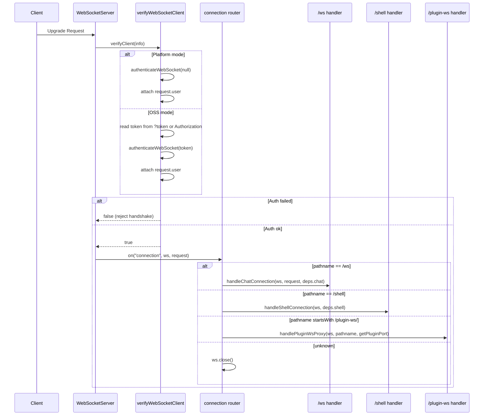
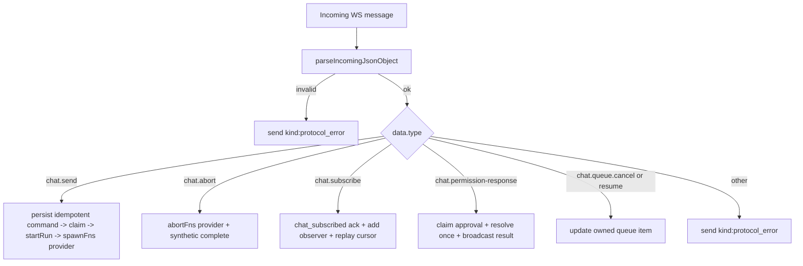
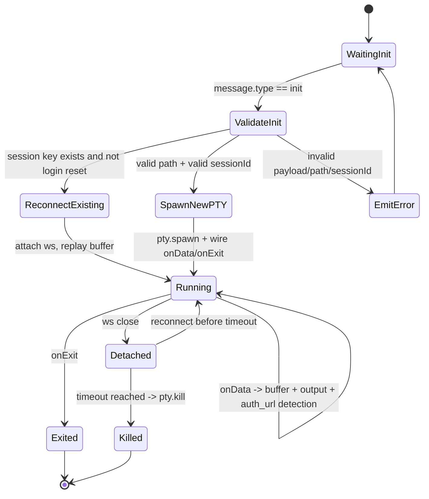
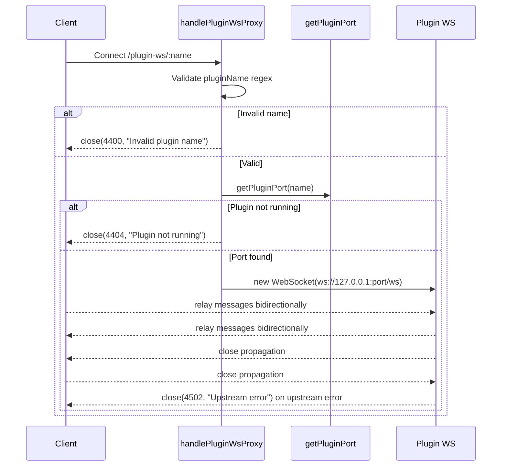

# WebSocket Module

This module owns the server-side WebSocket gateway used by:

1. Chat streaming (`/ws`)
2. Interactive terminal sessions (`/shell`)
3. Plugin WebSocket passthrough (`/plugin-ws/:pluginName`)

It is intentionally structured as **small services** plus a **barrel export** in `index.ts`.

## Public API

`server/modules/websocket/index.ts` exports:

1. `createWebSocketServer(server, dependencies)`  
Creates and wires the shared `ws` server.
2. `connectedClients` and `WS_OPEN_STATE`  
Shared chat client registry and open-state constant used by other modules.

## Why Dependency Injection Is Used

The module receives runtime-specific functions from `server/index.js` instead of importing legacy runtime files directly.

Benefits:

1. Keeps module boundaries clean (`server/modules/*` architecture rule).
2. Makes each service easier to test in isolation.
3. Keeps WebSocket transport concerns separate from provider runtime concerns.

## Service Map

| File | Responsibility |
|---|---|
| `services/websocket-server.service.ts` | Creates `WebSocketServer`, binds `verifyClient`, routes connection by pathname |
| `services/websocket-auth.service.ts` | Authenticates upgrade requests and attaches `request.user` |
| `services/chat-websocket.service.ts` | Handles the `/ws` chat protocol (`chat.send` / `chat.abort` / `chat.subscribe` / `chat.permission-response`) |
| `services/chat-run-registry.service.ts` | Tracks live provider runs per app session id: seq numbering, event replay buffer, provider-id mapping, completion state |
| `services/chat-session-writer.service.ts` | Gateway writer handed to provider runtimes: remaps provider session ids to app ids, swallows `session_created`, assigns `seq` |
| `services/shell-websocket.service.ts` | Handles `/shell` PTY lifecycle, reconnect buffering, auth URL detection |
| `services/plugin-websocket-proxy.service.ts` | Bridges client socket to plugin socket |
| `services/websocket-state.service.ts` | Holds shared chat client set and open-state constant |

## High-Level Architecture

```mermaid
flowchart LR
  A[HTTP Server] --> B[createWebSocketServer]
  B --> C[verifyWebSocketClient]
  B --> D{Pathname}
  D -->|/ws| E[handleChatConnection]
  D -->|/shell| F[handleShellConnection]
  D -->|/plugin-ws/:name| G[handlePluginWsProxy]
  D -->|other| H[close()]

  E --> I[connectedClients Set]
  E --> J[chatRunRegistry + ChatSessionWriter]
  F --> K[ptySessionsMap]
  G --> L[Upstream Plugin ws://127.0.0.1:port/ws]

  I --> M[projects.service loading_progress]
  I --> N[sessions-watcher.service session_upserted]
```

## Connection Handshake + Routing



## `/ws` Chat Flow

When a chat socket connects:

1. Add socket to `connectedClients`.
2. Parse each incoming message with `parseIncomingJsonObject`.
3. Dispatch by `data.type` (chat, queue, subscription, approval and heartbeat commands; none provider-specific).
4. On close, remove the socket from `connectedClients` and every session observer set.

### Session identity model

The frontend only ever knows the **app session id** (allocated by
`POST /api/providers/sessions` or discovered via the session index). The
provider-native id (JSONL file name, CLI resume id) stays inside the backend:

1. `chat.send` resolves the app id to `{ provider, provider_session_id, project_path }` from the sessions DB.
2. The provider runtime receives the provider-native id for resume.
3. The `ChatSessionWriter` remaps every outbound event back to the app id, and turns `session_created` announcements into a DB mapping update instead of forwarding them.

### Chat Message Dispatch



### Chat Notes

1. **Unified envelope**: every server-to-client frame carries a `kind` — either a provider `NormalizedMessage` kind or a gateway kind (`chat_subscribed`, `session_upserted`, `loading_progress`, `protocol_error`). There is no second `type`-based protocol.
2. **Unified terminal lifecycle**: every provider run ends with exactly one `complete` message built by `createCompleteMessage()` (`server/shared/utils.ts`): `{ kind: "complete", sessionId, actualSessionId, exitCode, success, aborted }`. The chat handler emits a synthetic `complete` for runs that crash or get aborted, and the run registry drops duplicate completes.
3. **Replay identity**: each run has a `runId`; live frames carry `cursor: { runId, seq }` plus the legacy `seq`. Sequence ranges are reserved in SQLite in blocks of 4096, so the legacy numeric cursor remains monotonic across turns and process restarts without a database write per token. Unused reserved numbers can create gaps between runs; replay begins at that run's initial sequence. The in-memory replay buffer still retains 5000 events.
4. `chat_subscribed` includes `isProcessing`, authoritative `pendingPermissions`, `queueItems`, `protocolVersion: 2`, `serverEpoch`, `cursor`, `replayFrom`, `replayReset` and `replayTruncated`. The ack's cursor is the **server head**, not the client's received watermark: set the replay cursor to `replayFrom` on reset and then advance only on received frames. If the buffer is truncated, also refresh REST history.
5. **Observers**: subscribing adds an authenticated observer rather than replacing another socket. Stream fan-out is scoped to the run's user; socket close and `chat.unsubscribe { sessionId }` remove observers. Starting a queued run looks up current observers and never reuses a closed connection captured at enqueue time.

### Durable command queue (protocol version 2)

`chat.send` accepts an optional `clientRequestId` alongside the existing `sessionId`, `content` and `options`. The current client supplies a UUID. The server stores the command in the application's existing SQLite database before returning `chat_send_ack { sessionId, clientRequestId, queueItemId, state, duplicate, protocolVersion }`.

- `(user_key, client_request_id)` is unique. Retrying identical data returns the same item; reusing an ID for different data returns `REQUEST_ID_CONFLICT`. Older clients may omit the field and receive a server-generated ID; arbitrary retries without an ID cannot be deduplicated.
- Pending commands are limited to 16 per user/session and 128 globally, with a 256 KiB combined content/options limit. Existing provider concurrency remains separately limited (default 4).
- `chat_queued` retains its legacy `position` field. `chat_queue_updated` and subscription acks carry owned `queueItems` with a bounded text preview, model, attachment count, state and recovery reason. Options and user identities are not sent in this view.
- `chat.queue.cancel { sessionId, queueItemId }` only cancels an owned pending item. It returns `chat_queue_action_ack`; `already_started` does not stop the current run. The existing `chat.abort` action still aborts the current run and clears that user's pending items for the session, before awaiting provider shutdown.
- A process restart changes unfinished prior-epoch rows to `needs_confirmation`. They are not scheduled until an explicit `chat.queue.resume { sessionId, queueItemId }`. `server_restarted_during_run` warns that some external steps may already have happened; resume is a deliberate re-send, **not** proof of exactly-once external effects.
- Legacy `queued_message_*` browser drafts are retained for manual review in the composer; the old background auto-send hook is removed.
- Attachment descriptors are normalized into the upload store at acceptance and checked again for canonical containment and existence immediately before execution.
- The running-state claim and sequence reservation share a database transaction. A failed claim cannot create a phantom active run. Completion/usage persistence failures still deliver the terminal event with a visible `persistenceWarning`.

SQLite was chosen because the app already owns a secured connection, schema initialization and durable session index. Queue rows hold data, not executable closures. No second database, broker or third task-state bus is introduced.

### Approval acknowledgement

`chat.permission-response` keeps the old fields and accepts an optional `sessionId`. The gateway finds an authoritative pending request in a run owned by the caller, claims its request ID synchronously, then calls the provider resolver once. Other observers cannot overwrite that decision. A duplicate answer returns `chat_permission_ack` with `already_resolved`; expired requests return `not_pending`.

A successful answer broadcasts `permission_resolved` and a sequenced `permission_cancelled { reason: "resolved" }` for older clients and sidebar counters. The requesting client receives `chat_permission_ack { status: "resolved", rememberEntry? }`. The UI keeps the request until acknowledgement and only persists an Allow-and-remember rule after its own successful ack.

This addition applies to the Mac `/ws` conversation protocol. The iOS/Python `/harness` SSE dialect is separate and is not silently changed by these fields.

## `/shell` Terminal Flow

The shell handler manages persistent PTY sessions keyed by:

`<projectPath>_<sessionIdOrDefault>[_cmd_<hash>]`

This enables reconnect behavior and isolates command-specific plain-shell sessions.

### Shell Lifecycle



### Shell Behaviors in Detail

1. `init`:
Reads `projectPath`, `sessionId`, `provider`, `hasSession`, `initialCommand`, `isPlainShell`.
2. Login reset:
For login-like commands, existing keyed PTY session is killed and recreated.
3. Validation:
Path must exist and be a directory; `sessionId` must match safe pattern.
4. Command build:
Provider-specific command construction with resume semantics.
5. PTY output buffering:
Stores up to 5000 chunks for replay on reconnect.
6. URL detection:
Strips ANSI, accumulates text buffer, extracts URLs, emits `auth_url` once per normalized URL, supports `autoOpen`.
7. Close behavior:
Socket disconnect does not instantly kill PTY; session is kept alive and terminated on timeout.

## `/plugin-ws/:pluginName` Proxy Flow



## Shared Client Registry and Broadcasts

Only chat sockets (`/ws`) are tracked in `connectedClients`.

That shared set is consumed by:

1. `modules/projects/services/projects-with-sessions-fetch.service.ts`
Broadcasts `kind: loading_progress` while project snapshots are being built.
2. `modules/providers/services/sessions-watcher.service.ts`
Broadcasts per-session `kind: session_upserted` deltas when provider session artifacts change (no full project snapshots).

This design centralizes cross-module realtime fanout without requiring route-local references to WebSocket internals.

## Error Handling and Close Codes

Current explicit close codes in this module:

1. `4400`: Invalid plugin name
2. `4404`: Plugin not running
3. `4502`: Upstream plugin WebSocket error

Other errors:

1. Chat handler catches and emits `{ kind: "protocol_error", code, error }`.
2. Shell handler catches and writes terminal-visible error output.
3. Unknown websocket paths are closed immediately.

## Extending This Module

To add a new websocket route:

1. Add a new handler service under `services/`.
2. Extend `WebSocketServerDependencies` in `websocket-server.service.ts` if needed.
3. Add a new pathname branch in the router.
4. Wire dependency injection from `server/index.js`.
5. Keep `index.ts` as barrel-only export surface.
