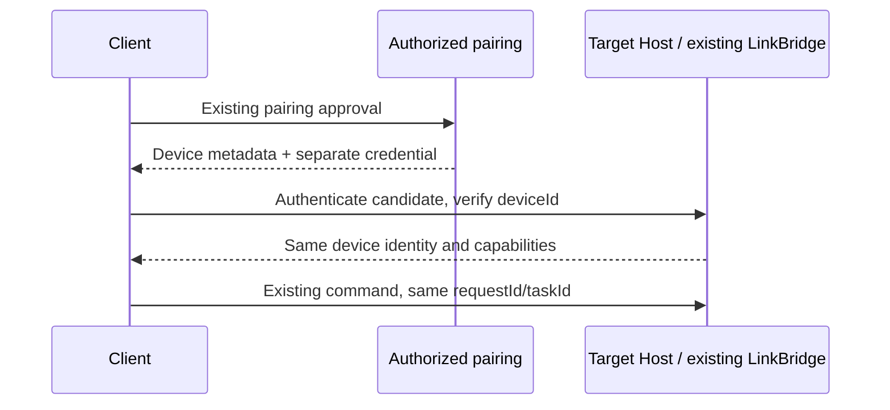
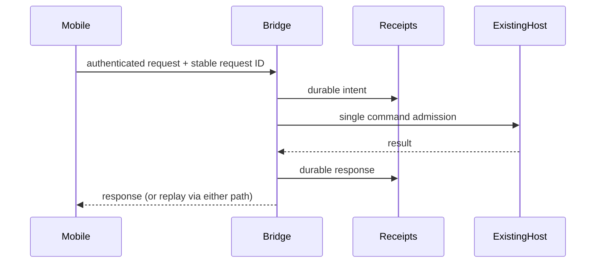

# Leo device connectivity v1

Approved scope: the 2026-09-28 iCloud + tailnet implementation plan.

## Owner and compatibility

The target Host owns a persistent device ID and advertises a versioned descriptor
as an additive field of existing pairing/capability responses. Existing relay
names and SSH aliases are not identity: only an authenticated pairing may bind
them to a device. Old clients continue to use the existing relay fields.

The shared descriptor is metadata, never a credential. Every direct endpoint
must return the paired device identity under authenticated HTTPS before it can
receive commands. Parsing a descriptor does not authorize a request. The target
Host still applies the same permission/approval rules on either path.

The Host persists its identity in `link-device-identity.json` under its existing
Leo data directory. Concurrent creation must converge on one complete file.
Corruption is reported, never repaired by silently generating a new identity.
Identity loading failure disables the new descriptor while retaining legacy
relay access, so recovery does not strand already-paired users.

## Wire contract

- `schemaVersion: 1`, stable UUID `deviceId`, user-facing `name`, `platform`.
- `capabilities`: extensible string names; unknown names do not grant access.
- `endpoints`: bounded list of unique IDs, `kind: direct | relay`, HTTPS
  `baseURL`, optional `expiresAt` (Unix milliseconds). No user info, fragments,
  query strings, passwords, access tokens or SSH keys in an endpoint.
- Optional `aliases` carry legacy identifiers for a subsequent verified mapping.
- Unknown descriptor fields are discarded when parsing, preserving the current
  contract without echoing unrecognized data into a pairing response.

Example (metadata only):

```json
{
  "schemaVersion": 1,
  "deviceId": "9c0f2c99-17cf-47a1-a370-d97161f68f9a",
  "name": "My Mac",
  "platform": "macos",
  "capabilities": ["harness", "resumable-events"],
  "endpoints": [{"id":"direct","kind":"direct","baseURL":"https://my-mac.example.ts.net/leo"}],
  "aliases": ["legacy-relay-name"]
}
```

## Event order



Tests must reject credential-bearing/cleartext URLs, duplicate endpoint IDs,
and unsupported schema versions, while retaining unknown capability names for
forward-compatible display. Later slices implement identity persistence, grants,
endpoint verification, route selection and durable operation receipts.

## Direct adapter and durable admission (2026-09-28)

The existing LinkBridge remains the only command admission owner. A dedicated loopback HTTP listener accepts only the mobile protocol, never the local management API. An explicitly configured HTTPS Tailscale Serve endpoint advertises the stable device UUID. No Serve/Funnel configuration is changed automatically.

Relay-authenticated identified callers may POST `/direct-grants`; response is `{device,grant:{token,targetDeviceId,expiresAt}}` (Unix seconds). The Mac stores only a token digest, caller, target and expiry. Direct requests carry `Authorization: Bearer …` and `X-Leo-Device-ID`; caller headers are ignored. Both adapters check a persistent local caller revocation list. A local one-time code allows relay-independent pairing through `/direct-pair`, with the target UUID embedded in the locally generated QR and checked during redemption. Pairing codes expire after five minutes and are consumed once. Grants cannot mint other grants.

Mutations carry `X-Request-ID` unchanged across paths. The bridge persists an admission intent before side effects and the response before replying. Identity + request ID key the receipt; the same key with different content is rejected. Concurrent retransmissions await the same execution. After a crash, completed responses replay; unfinished admission is surfaced as `operation_uncertain`, never blindly re-executed. GET `/operations/:requestId` allows explicit reconciliation. This gives at-most-once admission even at the side-effect/receipt crash boundary; automatic exactly-once recovery requires a runtime acknowledgement and is not inferred from an HTTP failure. Session index writes finish before successful create responses. Receipts containing uncertainty are retained rather than timed out into duplicate execution.



### Runtime reconciliation boundary

V4 `createSession` accepts a stable command ID; `sendPrompt.traceId` is the persisted `sendText` command ID. The bridge passes deterministic, caller-scoped IDs and checkpoints the created task before first send. It retains the existing subscribe-before-send order: the alternative of sending `firstInput` inside create would start output/approvals before the mobile journal exists. Recovery queries the existing V4 command facts through the task service. A known accepted send replays its response; a known failed admission reports failure; an unknown command is never treated as proof that execution did not happen. A checkpointed, not-yet-submitted input can be resumed through the same runtime admission key. No second task queue is introduced.

### Local setup and rollback

Mac → Connect Phone → Tailscale direct settings accepts the machine's HTTPS `*.ts.net` origin and a dedicated loopback port (default 38474). Saving starts the listener within 15 seconds; it does not run Tailscale commands. Preview/check existing Serve configuration first, then explicitly map an unused HTTPS listener to that loopback port. Keep the relay endpoint configured. Verify `/v1/capabilities` using the paired credential and `X-Leo-Device-ID`; unauthenticated access must be 401 and local `/api/leo/*` must never be exposed. A bound localhost port alone is not proof the public HTTPS endpoint is ready.

`syncEnabled` and `treasuryEnabled` are independent explicit opt-ins. New grants receive only enabled scopes; existing grants remain limited until renewed. Replica storage uses `~/.leoagent/link/sync-replica`; Treasury uses the same Host TreasuryStore instance. Disabling direct stops the listener while preserving pairing identities, receipts and replica data. Individual revoke affects both relay and direct admission at this Mac; relay revocation snapshots and live notifications update the same local registry. A disconnected Mac learns relay-side revocation when the trusted connection returns; direct locally stored revocation is immediate.

## Pairing panel lifecycle (2026-10-03 audit)

The mounted pairing panel owns one pending issuance and at most one displayed
one-time code. It does not own or change device grants, task queues or approval
policy. A refresh clears the displayed image before revoking the previous code;
a revocation failure is visible and prevents issuing another code until retry.
Closing the panel invalidates its presentation lifetime: a code arriving after
close, or a code whose QR rendering fails, is submitted to the existing revoke
endpoint rather than silently retained. Cleanup failures are contained and
reported without logging the credential. Remote revocation remains best effort
on unmount/network failure; the existing five-minute server expiry is unchanged.
Older bridges without revoke retain their existing expiry-only behavior.

```
panel → single pending issuance → credential → QR image → visible code
close/render failure ─────────────────┘ → existing revoke endpoint
```

Repeated clicks during issuance are ignored synchronously. Reopening creates a
new owner; late results from the closed owner cannot clear or overwrite its code.
Status requests do not overlap, rejections produce a visible error, and a later
successful poll recovers normally. Error display never represents stale status
as a fresh successful connection.

Relay DELETE reports success only for a successful response or 404 (already
consumed/expired). Authentication rejections may try the existing fallback key;
exhausted credentials and other HTTP failures propagate through the existing IPC
error result. URL, token payload, pairing response, grant and disk formats remain
unchanged. Tests cover late arrival, close during QR generation, retry, repeated
clicks, replacement failure, malformed responses, and actual relay single-use and
revocation semantics using isolated synthetic keys.
