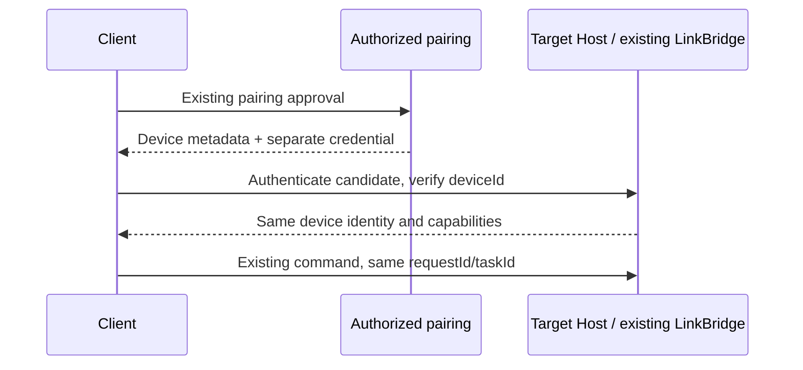

# Leo device connectivity v1

Approved scope: the 2026-09-28 iCloud + tailnet implementation plan.

## Owner and compatibility

The target Host owns a persistent device ID and advertises a versioned descriptor
as an additive field of existing pairing/capability responses. Existing relay
names and SSH aliases are not identity: only an authenticated pairing may bind
them to a device. Old clients continue to use the existing relay fields.

The shared descriptor is metadata, never a credential. Every direct endpoint
must return the paired device identity under authenticated HTTPS before it can
receive commands. Parsing a descriptor does not authorize a request. The target
Host still applies the same permission/approval rules on either path.

## Wire contract

- `schemaVersion: 1`, stable UUID `deviceId`, user-facing `name`, `platform`.
- `capabilities`: extensible string names; unknown names do not grant access.
- `endpoints`: bounded list of unique IDs, `kind: direct | relay`, HTTPS
  `baseURL`, optional `expiresAt` (Unix milliseconds). No user info, fragments,
  query strings, passwords, access tokens or SSH keys in an endpoint.
- Optional `aliases` carry legacy identifiers for a subsequent verified mapping.
- Unknown descriptor fields are discarded when parsing, preserving the current
  contract without echoing unrecognized data into a pairing response.

Example (metadata only):

```json
{
  "schemaVersion": 1,
  "deviceId": "9c0f2c99-17cf-47a1-a370-d97161f68f9a",
  "name": "My Mac",
  "platform": "macos",
  "capabilities": ["harness", "resumable-events"],
  "endpoints": [{"id":"direct","kind":"direct","baseURL":"https://my-mac.example.ts.net/leo"}],
  "aliases": ["legacy-relay-name"]
}
```

## Event order



Tests must reject credential-bearing/cleartext URLs, duplicate endpoint IDs,
and unsupported schema versions, while retaining unknown capability names for
forward-compatible display. Later slices implement identity persistence, grants,
endpoint verification, route selection and durable operation receipts.
